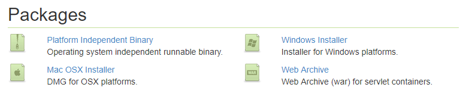

# 安装 GeoServer

>此系列文章使用的是[GeoServer 2.11.2](http://geoserver.org/release/2.11.2/)
和Windows系统，并且使用的是[JRE8](http://www.oracle.com/technetwork/java/javase/downloads/jre8-downloads-2133155.html)，
使用其他版本可以作参考。

## 安装
首先下载[JRE8](http://www.oracle.com/technetwork/java/javase/downloads/jre8-downloads-2133155.html)
并安装，然后下载[GeoServer](http://geoserver.org/download/)，如果对每个版本不清楚就选择
[Stable](http://geoserver.org/release/stable/)版本，选择合适的安装包，这里我选择的是*Windows Installer*。

下载完成后，双击安装文件运行。

在欢迎界面点击 **Next**。

阅读[许可](http://docs.geoserver.org/latest/en/user/introduction/license.html#license)，点击 **I Agree**。

选择安装目录，然后点击 **Next**。

选择开始菜单文件夹名和位置，然后点击 **Next**。

选择JRE的安装目录，GeoServer需要验证JRE的有效性。安装程序会尝试从系统中寻找JRE的路径并显示在文本框中，
如果没有找到你就需要手动选择安装路径，然后点击 **Next**。
>注意： Windows中的路径通常是`C:\Program Files\Java\jre8`。

>注意： 不要在JRE路径中包含`\bin`。假如`java.exe`位于`C:\Program Files (x86)\Java\jre8\bin\java.exe`，只需设置路径为`C:\Program Files (x86)\Java\jre8`。

输入GeoServer的默认数据目录。如果你是第一次使用GeoServer，选择 **Default data directory**，
点击 **Next**。

输入GeoServer管理员账号的用户名和密码。GeoServer的web管理界面需要认证才能使用，
这里输入的就会成为管理员账号。默认账号密码是 **admin/geoserver**。建议修改默认值，
然后点击 **Next**。

输入GeoServer将要使用的端口号。这将影响到GeoServer的Web管理界面，也会影响到GeoServer的服务，
比如[Web Map Service (WMS)](http://docs.geoserver.org/latest/en/user/services/wms/index.html#wms)
和[ Web Feature Service (WFS)](http://docs.geoserver.org/latest/en/user/services/wfs/index.html#wfs)。
默认的端口是 **8080**，所有有效的并且没有使用的端口都可以，设置完成后点击**Next**。

选择GeoServer手动启动还是作为一个服务安装。如果是手动启动，GeoServer就像一般程序那样点击运行。
如果是作为服务安装，GeoServer就会整合到Windows服务中，这样有利于管理。这里我选择的是 **Run manually**，
然后点击 **Next**。

回顾一下安装信息，如果又需要修改的地方点击 **Back** 进行修改，否则就可以点击 **Install** 开始安装。

安装完后点击 **Finish** 关闭安装程序。如果作为服务安装，则服务已自动启动；如果选择手动，
就可以在开始菜单中找到 **Start GeoServer**，点击启动服务。

最后可以浏览`http://localhost:8080/geoserver`(或者安装时设置的其他端口号)进入Web管理界面。

## 卸载
在开始菜单中GeoServer文件夹下运行`uninstall.exe`卸载，或者在Windows程序管理中卸载。