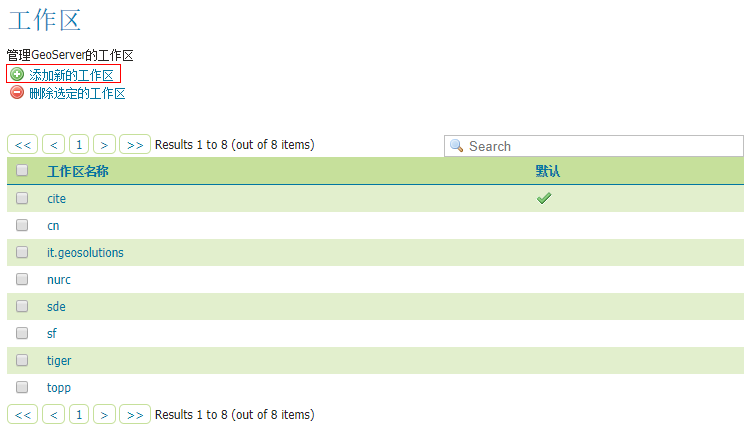
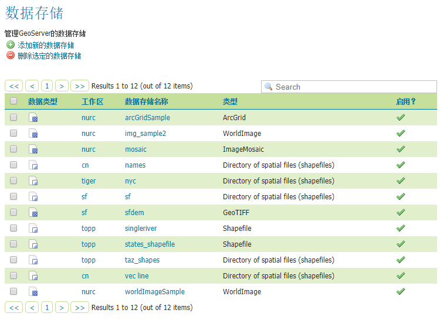
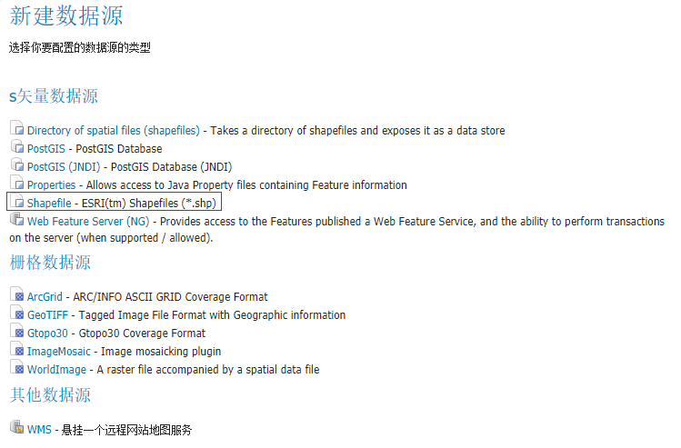
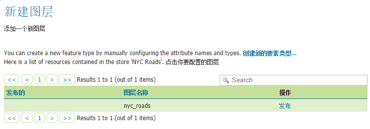
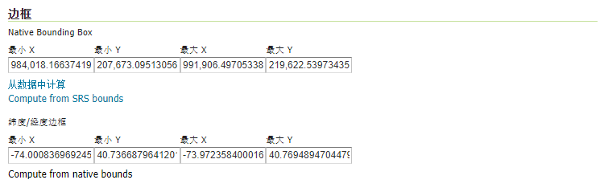
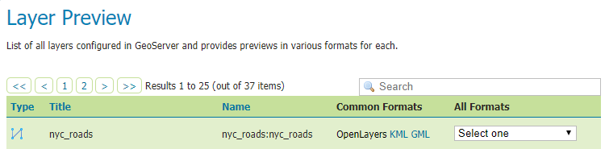
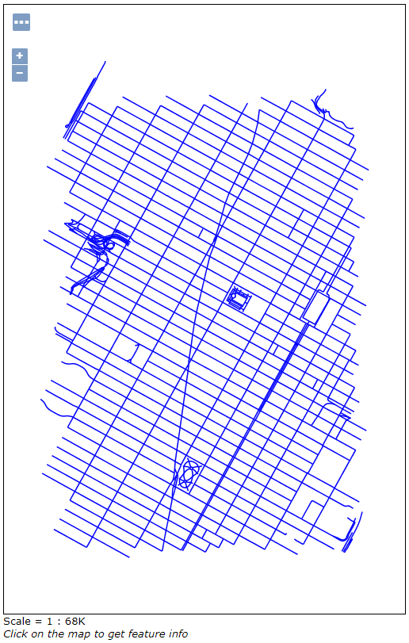

# 发布Shapefile图层

此文介绍如何将Shapefile数据通过GeoServer发布。

## 准备数据
数据源就使用官方文档中使用的[nyc_roads.zip](http://docs.geoserver.org/latest/en/user/_downloads/nyc_roads.zip),
下载后解压后得到`nyc_roads`文件夹，文件夹内应该有以下四个文件

```
nyc_roads.shp
nyc_roads.shx
nyc_roads.dbf
nyc_roads.prj
```

将`nyc_roads`文件夹放入GeoServer的`<GEOSERVER_DATA_DIR>/data`目录中，
其中`<GEOSERVER_DATA_DIR>`是安装时的数据目录，默认为`../geoserver/data_dir`。

## 创建一个工作区

在[前文](./wmi_intro.md)中讲到。工作区是一个服务的数据集合。
新建一个工作区用来发布服务。

导航到**工作区**。

在工作区选项卡中，下方是工作区列表，点击“**添加新的工作区**”来创建工作区。



在**Name**中填写`nyc_roads`,这是工作区的名称，会影响到服务地址，此时服务地址为`localhost:8080/geoserver/nyc_roads`。
在**命名空间 URI**中填写`http://geoserver.org/nyc`，该路径是名称空间，不需要是有效的Web地址。


点击**提交**就添加`nyc_roads`到工作区列表中了。

## 创建一个数据存储

数据存储是将数据文件链接到GeoServer中，所以需要添加一个数据存储链接Shapefile文件。

导航到**数据存储**。

在数据存储标签页中有现有的数据存储列表，点击**添加新的数据存储**。



因为我们的数据源是Shapefile，所以选择**Shapefile**项。



在**新建矢量数据源**页面中，**工作区**选择`nyc_roads`,
**数据源名称**填写`NYC Roads`，**说明**填写`Roads in New York City`。

**Shapefile文件的位置**文本框右边有**浏览...**，点击选择准备的`nyc_roads.shp`。

**DBF字符集**选择`GB2312`，这样能够支持中文属性字段。


点击**保存**就会导航到**新建图层**页面，接下来要创建图层。

## 创建一个图层

在**新建图层**页面，点击图层名`nyc_roads`右边的发布**发布**。



在**编辑图层**界面，可以修改**命名**，**标题**和**摘要**。


在**边框**中分别点击**从数据中计算**和**Compute from native bounds**。



想要了解其他设置项，可以在[官网](http://docs.geoserver.org/latest/en/user/data/webadmin/layers.html#data-webadmin-layers)
获取更多信息。

在这里我们点击**保存**就完成了图层的创建。

## 浏览
图层创建后能够在**Layer Preview**中找到，点击右边的**OpenLayers**在Openlayers地图中预览。





如果需要使用WMS服务，则服务地址为`localhost:8080/geoserver/nyc_roads/wms`，可以访问的图层就是`nyc_roads`，
更多WMS参数可以到[这里](http://docs.geoserver.org/latest/en/user/services/wms/reference.html)查看。

## 相关链接

* [发布Shapefile的官方教程](http://docs.geoserver.org/latest/en/user/gettingstarted/shapefile-quickstart/index.html)
