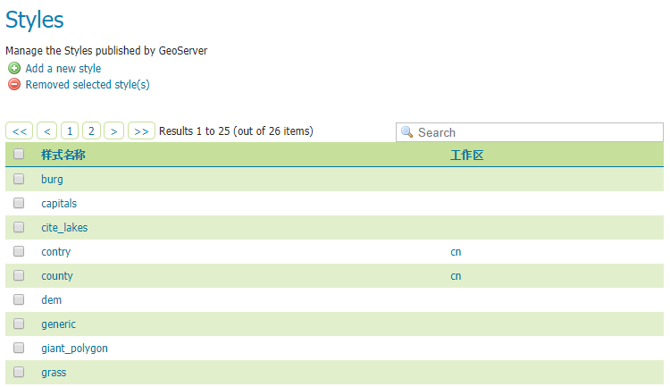
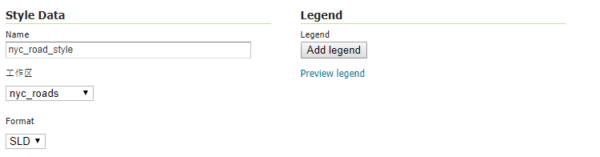
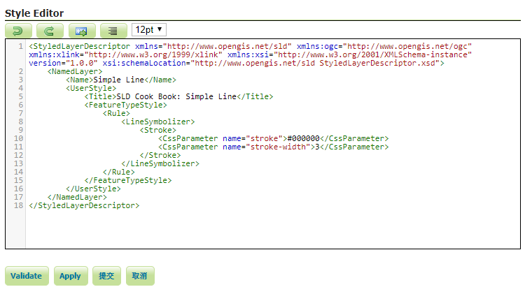
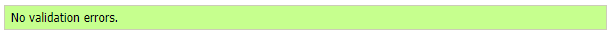
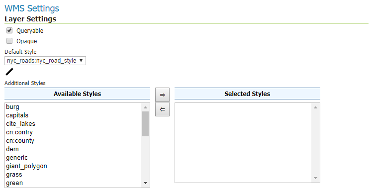
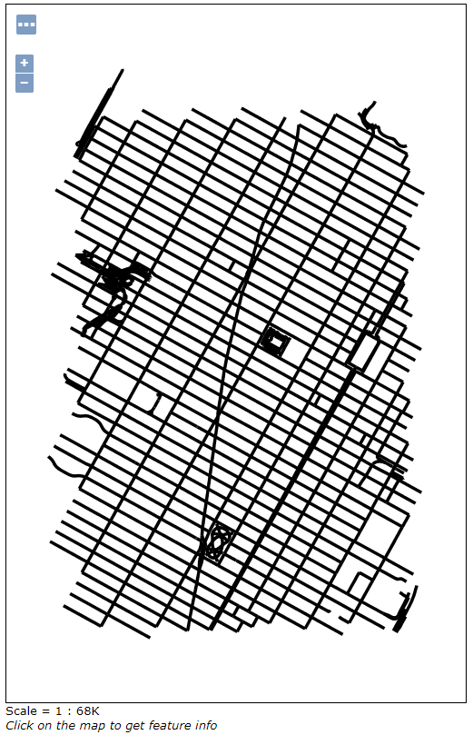

# WAI中设置样式

在GeoServer中设置图层样式通常使用[STD(Styled Layer Descriptor)](http://www.opengeospatial.org/standards/sld)，
在Web管理界面（WAI）中自带STD编辑器，此文介绍如何在WAI中使用STD设置图层样式。

## Styles 页面

在WAI的**Styles**页面中，列出了当前所有的样式。



在这里你可以添加样式（_Add a new style_），移除现有样式（_Removed selected style(s)_），
或者点击现有样式进行编辑。

## 添加一个样式

点击**Add a new style**进入新建样式页面。

在**Name**中命名样式为`nyc_road_style`。

在**工作区**项选择之前建立的`nyc_roads`。



然后在编辑器中填写STD代码，由于这个样式将要用在`nyc_roads.shp`上，
这个图层都是线要素，所以使用针对线要素样式的STD。这里我将使用以下代码

```
<StyledLayerDescriptor xmlns="http://www.opengis.net/sld" xmlns:ogc="http://www.opengis.net/ogc" xmlns:xlink="http://www.w3.org/1999/xlink" xmlns:xsi="http://www.w3.org/2001/XMLSchema-instance" version="1.0.0" xsi:schemaLocation="http://www.opengis.net/sld StyledLayerDescriptor.xsd">
    <NamedLayer>
        <Name>Simple Line</Name>
        <UserStyle>
            <Title>SLD Cook Book: Simple Line</Title>
            <FeatureTypeStyle>
                <Rule>
                    <LineSymbolizer>
                        <Stroke>
                            <CssParameter name="stroke">#000000</CssParameter>
                            <CssParameter name="stroke-width">3</CssParameter>
                        </Stroke>
                    </LineSymbolizer>
                </Rule>
            </FeatureTypeStyle>
        </UserStyle>
    </NamedLayer>
</StyledLayerDescriptor>
```

这段代码只是将线的颜色设置为黑色`#000000`，线宽设置为3。

在**Style Editor**中写完以后，可以点击**Validate**按钮，测试代码是否有误。



如果无误会在页面上方显示`No validation errors`



否则会显示错误信息。


确认无误以后点击**提交**，就会保存编辑内容，并新建一个样式，可以在表格中找到。

## 应用样式到图层

我们将对[之前](./post_shape.html)发布的`nyc_roads`图层应用新的样式。

在图层页面中找到`nyc_roads`图层，点击进入编辑界面，选择**发布**选项卡。


在**WMS Settings**>**Layer Settings**>**Default Style**中选择`nyc_roads:nyc_road_style`，
也就是刚才创建的样式，其中`nyc_roads`表示样式的工作区，`nyc_road_style`表示样式名称。



如果你想使用多个样式，可以在下方的**Additional Styles**中左侧选择想要附加的样式，点击**=>**按钮添加到右侧。
也可以选中右侧中添加的样式点击**<=**按钮取消添加。

设置完成后点击页面下方的**保存**应用设置。然后可以在**Layer Preview**中预览`nyc_roads`图层，
发现样式已经应用，线变宽了，颜色也变为黑色。



想要了解更多STD的用法，可以在[官方教程](http://docs.geoserver.org/latest/en/user/styling/sld/index.html)查看。

## 相关链接

* [GeoServer中设置样式的方式](http://docs.geoserver.org/latest/en/user/styling/index.html)