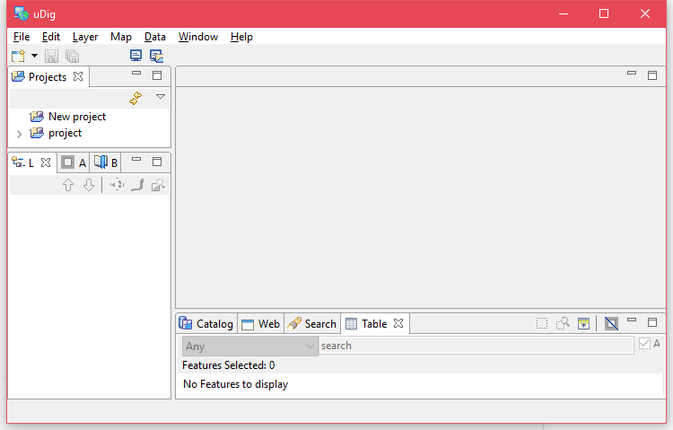
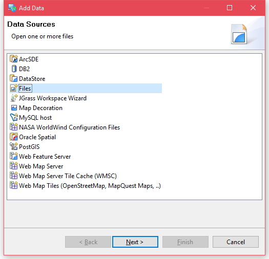
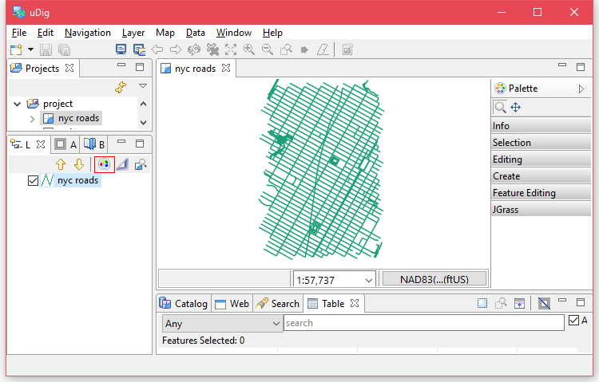
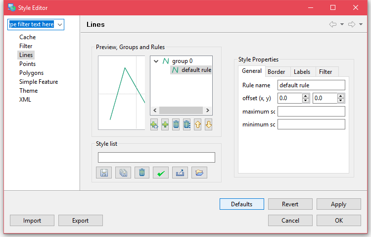
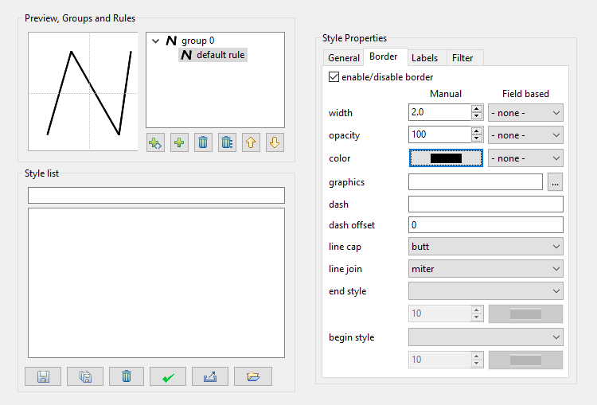
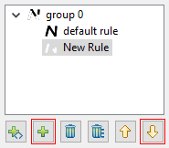
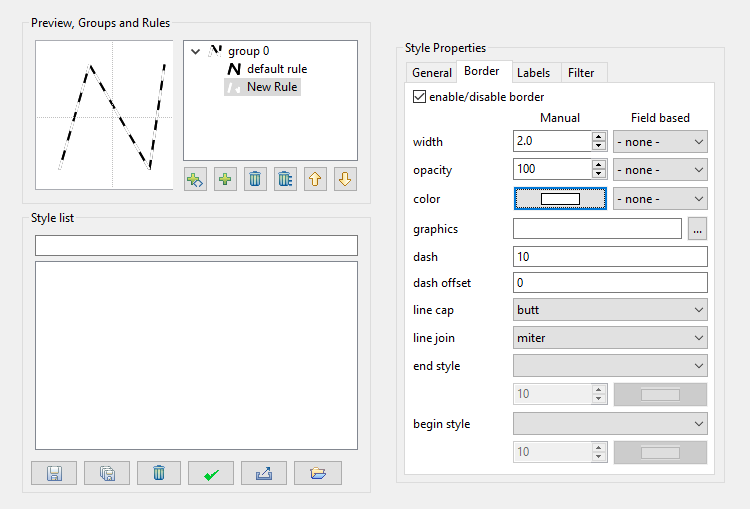
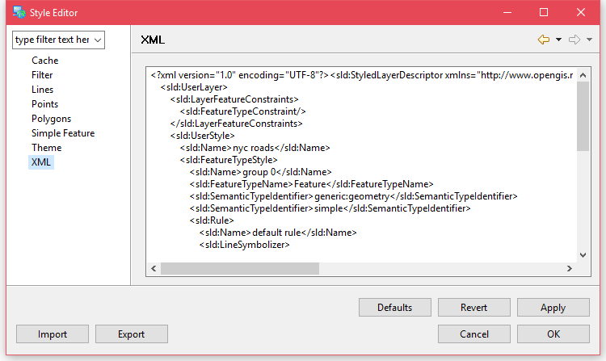
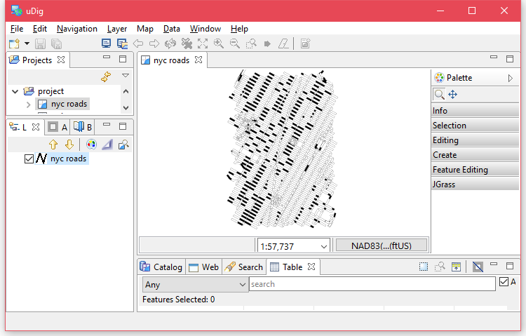

# 使用uDig辅助样式设置

如果对SLD不太熟悉，只想做一些简单的样式设置的话，可以使用软件[uDig](http://udig.refractions.net/)
辅助生成SLD代码。

## 安装uDig

首先到[官网](http://udig.refractions.net/download/)下载合适的安装包，
我这里使用的是`Release 2.0.0.RC1`版本，`x86_64 Zip`，这样我就可以不用安装，
直接在文件夹中运行`udig.bat`，你也可以下载安装包安装到系统中。

## 导入Shapefile

在菜单栏选择**Layer**>**Add...**，进入添加数据窗口。

选择**Files**，点击**Next**按钮并在文件选择对话框中找到之前的`nyc_roads.shp`，打开。

## 设置线段样式

在图层列表中选中`nyc_roads`，点击右上角的调色盘，打开样式设置窗口

由于`nyc_roads`图层都是线要素，所以我们只用关心线要素的样式定义。
在**Lines**页面中，我们有一个`group0`样式组，还有一个默认样式`default rule`。

在**Border**选项卡中设置线的样式，*width*设置为`2.0`，*color*设置为黑色。

在样式组下方点击**＋**添加一个新规则，再点击**↓**将它移到上一个规则上层。

将新规则的*with*也设置为`2.0`，*color*设置为白色，*dash*设置为`10`。

这时候可以在左上方的预览图中看到最终效果，是黑白相间的线段，白色线段的长度为10个单位。

点击**Apply**保存设置，再点击左侧的**XML**标签就会在右侧显示对应SLD代码。

## 预览样式

设置完成后，点击**OK**按钮，保存并退出样式设置窗口，回到uDig主界面，
会发现样式已经应用了，可以在预览窗口中缩放，拖动查看效果。

## 使用样式

现在有了SLD代码，可以像[上文](./style.html)那样在GeoServer中对图层使用新样式。

更多uDig的属性设置可以动手试试，或者到[uDig官网](http://udig.refractions.net/users/)
获取更多相关资料。

## 相关链接

* [uDig官方资料](http://udig.refractions.net/users/)
* [GeoServer SLD 教程](http://docs.geoserver.org/latest/en/user/styling/sld/index.html)
