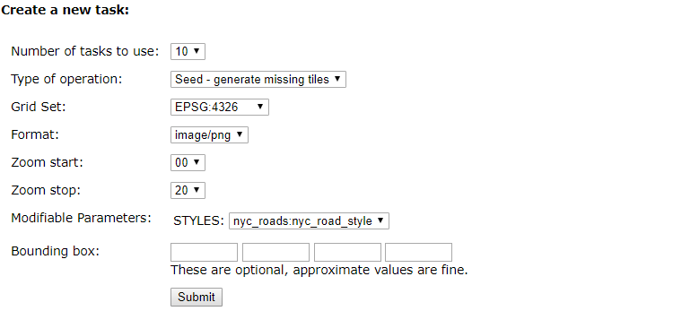
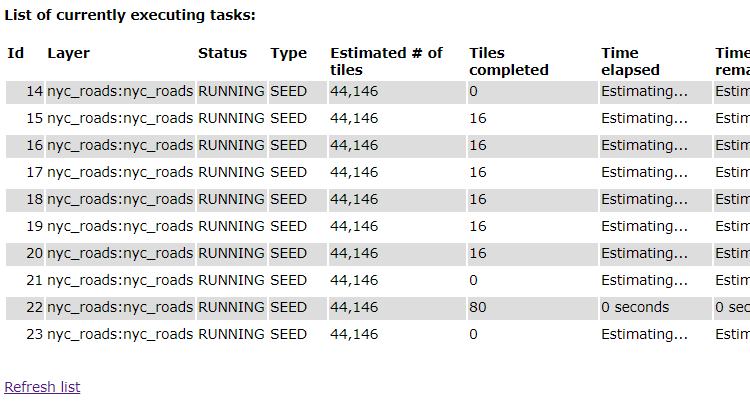

# 生成图层瓦片数据

地图数据通常以瓦片图的形式发布，而访问量比较大的时候就不能让GeoServer实时创建瓦片图，
应提前生成瓦片图，让服务器直接提供所需的图像，减轻服务器的压力。

## 生成图层瓦片图

GeoServer提供了现成的切图工具，可以将矢量图层预先切成标准的瓦片数据。

在WAI中点击左侧的**Tile Caching**>**Tile Layers**，右侧显示现有的图层列表，
点击`nyc_roads`图层所在行右侧的`Seed/Truncate`，进入瓦片制作工具。

在**Create a new task**中修改参数

*Number of tasks to use*使用的线程数为`10`

*Zoom stop*最大级别为`20`，由于数据量比较小，所以到20级也不会很大。

点击**submit**按钮就开始切割了，可以在表格中看到进度

过一会点击**Refresh list**链接，查看进度，切片应该很快就完成了。

切片完成后可以到`<GEOSERVER_DATA_DIR>/gwc/nyc_roads_nyc_roads`中看到切好的图片，
这里`<GEOSERVER_DATA_DIR>`是GeoServer的数据目录，`nyc_roads_nyc_roads`是工作区和图层名的组合。

## 相关链接

* [官方瓦片图制作相关资料](http://docs.geoserver.org/latest/en/user/geowebcache/webadmin/layers.html)