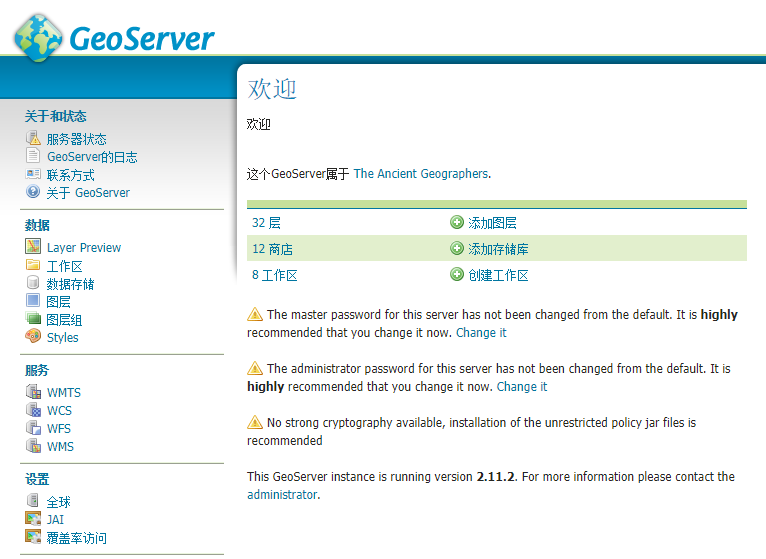

# Web管理界面简介
在[安装GeoServer](./install.html)中讲到，安装完成后浏览`http://localhost:8080/geoserver`
(或者安装时设置的其他端口号)就能进入Web管理界面。在右上角输入用户名和密码（默认为 *admin/geoserver*）就可以登陆管理程序。

* **服务器状态**
在这里可以看到服务器的常用参数，数据目录，内存占用，JAI环境参数等。

* **Layer Preview** 
图层预览，查看当前的可用图层，数据类型，图层工作区，图层名等，并且可以点击`OpenLayers`预览图层。

在预览地图中点击要素还能得到要素属性信息。

* **工作区**
工作区是一个服务的数据集合，一个工作区对应一个服务，一个工作区可以含有多个数据图层，图层组。

* **数据存储**
数据存储链接服务器上的实际数据文件，如`.shp`，瓦片地图等，为图层提供数据源。

* **图层**
单个数据源对应一个图层，往往将同一类要素放在一个图层，分多个图层存储GIS数据，如建筑，河流，湖泊等。

* **图层组**
将多个图层整合在一起，统一显示，用于地图配置方案，将所需的图层结合在一起，以一个图层组的形式发布。

* **Styles**
包含可用的样式，每个样式都是一个配置文件，可以针对性的调整不同数据类型的显示样式，还提供针对地理信息数据特有的过滤器。
样式最终应用于图层或图层组，一个图层或图层组可以有多个样式，但是通常为每个图层配置一个样式。

* **服务**
不同的服务对应的设置，若需要特别设置可以针对性的为某个服务进行设置。