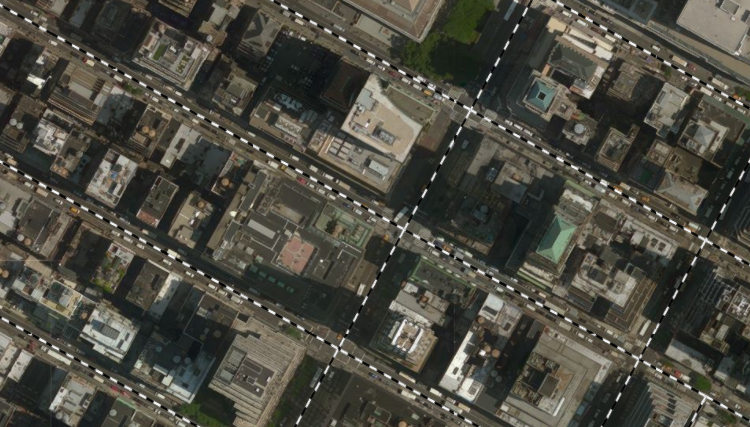

# 在Cesium中访问WMS服务

Cesium提供了多种地图服务支持，当前GeoServer支持WMS 1.1.1。我是用的Cesium 1.35 也支持WMS 1.1.1。

## 访问不使用缓存数据的WMS

Geoserver的WMS服务路径格式为`http://<ip>:<port>/geoserver/<work-space>/wms`。

其中`<ip>`和`<port>`表示服务器的IP和端口号，`<work-space>`表示工作区的名称。

在这里我使用的本地服务，并且端口号为8085，所以服务路径为`http://localhost:8085/geoserver/nyc_roads/wms`。

在Cesium加载WMS图层的代码如下

```
var provider = new Cesium.WebMapServiceImageryProvider({
              url: 'http://localhost:8085/geoserver/nyc_roads/wms',
              layers: 'nyc_roads:nyc_roads',
              parameters: {
                  format: 'image/png',
                  transparent: true,
              }
          });

viewer.imageryLayers.addImageryProvider(provider);
```

在Cesium中的结果



## 访问使用瓦片缓存数据的WMS

使用瓦片缓冲（GeoWebCache）访问WMS，只需在普通路径`/wms`前添加`/gwc/service`。

所以路径就变为`http://localhost:8085/geoserver/nyc_roads/gwc/service/wms`。

同时可以限制最大级别为`21`，因为我们只切了`0-20`级，总共21个级别。

修改代码为

```
var provider = new Cesium.WebMapServiceImageryProvider({
              url: 'http://localhost:8085/geoserver/nyc_roads/gwc/service/wms',
              layers: 'nyc_roads:nyc_roads',
              maximumLevel: 21,
              parameters: {
                  format: 'image/png',
                  transparent: true,
                  tiled: true
              }

          });

viewer.imageryLayers.addImageryProvider(provider);
```

由于在最大级别时已经是很大的比例尺，所以两者显示区别并不大。但使用瓦片缓存数据可以有效减少服务器的压力。

## 相关链接

* [WMS 详细资料](http://docs.geoserver.org/latest/en/user/services/wms/index.html)
* [Cesium 官网](https://cesiumjs.org/)